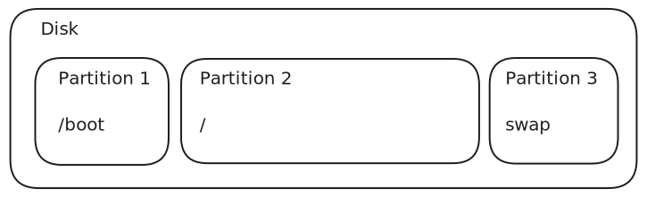

HDD や SSD などのディスクは, 複数の論理的な区画へと分割して利用できます.  
この論理的な区画のことをパーティションと呼びます.

Linux では通常このパーティション上にファイルシステムを作成し, そのファイルシステムをマウントすることで各種ファイルやディレクトリの保存やアクセスが行えるようになります.

## なぜパーティションを切るのか

物理的なディスクで論理的なパーティションを区切ることで次のようなメリットが得られます.

- 一部の記憶領域に障害が出たとしても, 他のパーティションを継続して使い続けることができる
- 異なるディスク特性を要求したい用途にそれぞれ対応できる

基本的に 1 つの一般用途であればパーティションを切ることはそれほど多くないでしょう.
Linux 的文脈では /boot や swap 領域等に関しては, パーティションを区切ることが推奨されています.