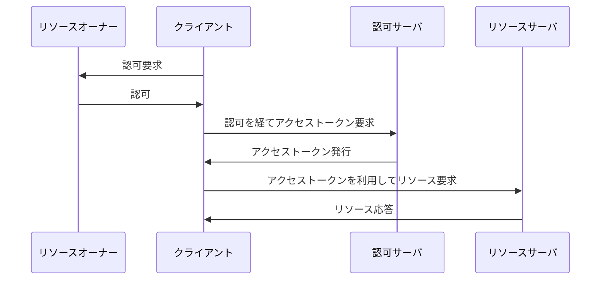

## 概要

OAuth 2.0 は自身のサービスが保有するリソースに対して, サードパーティアプリケーションがアクセスすることを認可するためのフレームワークの 1 つです.

従来, 外部サービスの情報を参照しようとする際には, ユーザの認証情報をサードパーティアプリケーションに直接渡し, それを元に情報を操作する要がありました.
この形態には次の問題点があります.

| 問題点         | 詳細                                                                                                                   |
| -------------- | ---------------------------------------------------------------------------------------------------------------------- |
| 認証情報の保有 | 後々利用可能な形で認証情報を保持することになるため, パスワードなどであっても, 平文や復号可能な暗号で保持せざるを得ない |
| 権限の派生     | ユーザが可能な操作をすべて行えることになるため, 読み込みだけ許可したくても, 書き込み権限も同時に渡ってしまう           |
| 取り消し困難   | アクセス許可取り消し = 認証情報の変更となるため, 1 つのアプリケーションのみ許可取り消しは不可能                        |

OAuth 2.0 ではアクセストークンと呼ばれる一時的な認証情報を利用して, サードパーティアプリケーションからのアクセスを制御します.

これによって従来の問題点を解決し, 適切にリソースへのアクセスを許可/制限することが目的になります.

## 特徴

OAuth 2.0 の特徴は次の通りです.

- **アクセストークン**: アプリケーション毎に異なる一時的な認証情報を利用することで, 認証情報の漏洩リスクを低減
- **認可フローの選択**: クライアントの種類やセキュリティ要件に応じて, 適切な認可フローを選択可能
- **スコープ制御**: アクセストークンに対して, どのリソースにアクセスできるかを制限可能

## 登場人物

| 役割             | 説明                                                             |
| ---------------- | ---------------------------------------------------------------- |
| クライアント     | リソースにアクセスしようとしているサードパーティアプリケーション |
| リソースオーナー | 保護されたリソースを所有しているユーザ                           |
| リソースサーバ   | 保護されたリソースを提供するサーバ                               |
| 認可サーバ       | クライアントにアクセストークンを発行するサーバ                   |

### クライアントの種類

OAuth 2.0 では, クライアント自体を識別するためのクライアント ID 及びクライアントシークレットを利用します.

これらの情報をセキュアに保持できるかどうかによって, クライアントの種類が分けられます.

| クライアントの種類             | 説明                                                     | 例                  |
| ------------------------------ | -------------------------------------------------------- | ------------------- |
| コンフィデンシャルクライアント | クライアントシークレットを安全に保持できるクライアント   | サーバサイドアプリ  |
| パブリッククライアント         | クライアントシークレットを安全に保持できないクライアント | モバイルアプリ, SPA |

## フロー

簡易に表すと OAuth 2.0 のフローは次のようになります.

- クライアントがリソースオーナーに対して認可を要求する
- リソースオーナーが認可する
- クライアントが認可サーバからアクセストークンを取得する
- クライアントがアクセストークンを利用してリソースサーバにアクセスする

このリソースオーナーが行える認可方法やアクセストークンの発行に必要な情報は, クライアントの種類やセキュリティ要件に応じて異なります.
種々の要件に合わせて選択できるよう, OAuth 2.0 では様々な認可フローが定義されています.
